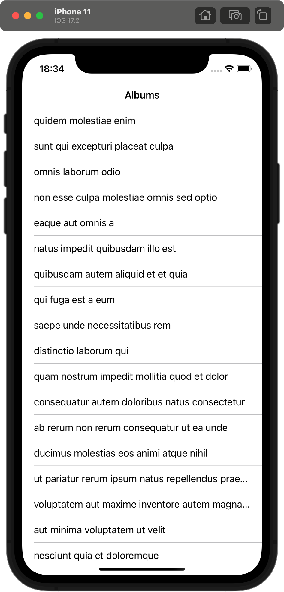
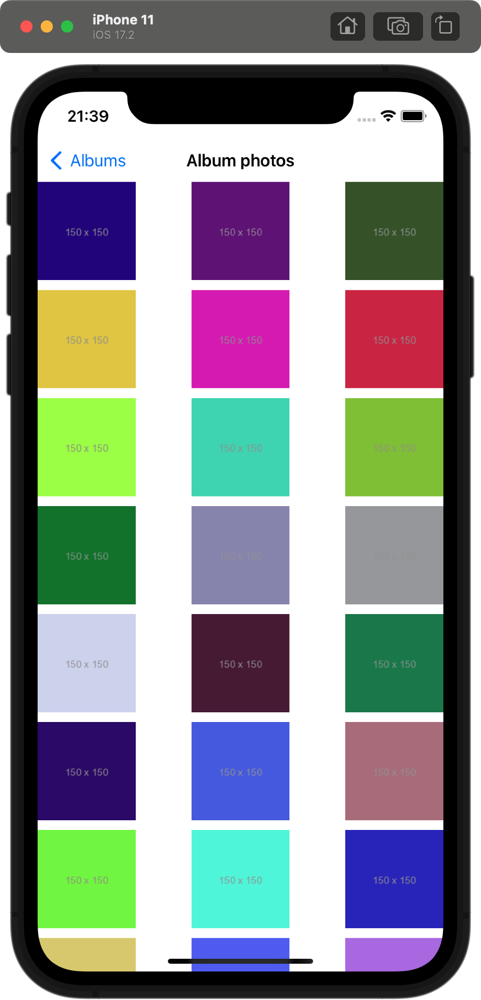

# iOSMvvmCross
This is sample master/detail project using MvvmCross library in Xamarin.iOS.
Data is populated from jsonplaceholder.typicode.com REST API.
Master view shows list of albums (in UITableView) and after user selection, details view shows collection of images associated with selected album (in UICollectionView).

MvvmCross is a cross-platform MVVM framework. It enables developers to create apps using the MVVM pattern on Xamarin.
  
&nbsp;&nbsp;&nbsp;
